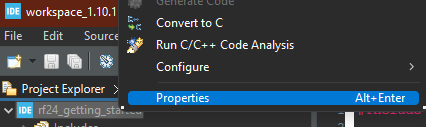
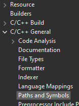
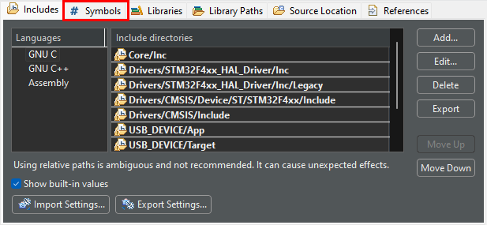
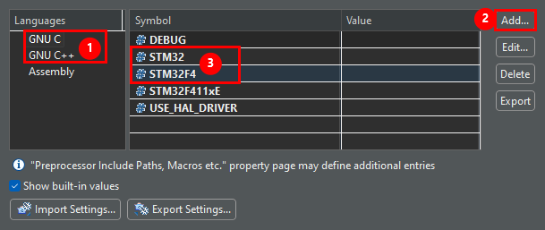

# Using RF24 in the STM32Cube IDE

The RF24 library can be integrated with any STM32Cube project.

## Required Hardware

The nRF24L01 radio requires 1 SPI bus and 2 GPIO pins for minimal usage. If using the radio's IRQ pin, then that will require an additional GPIO pin.

You can use the IDE set up the necessary GPIO/SPI pins and have the IDE automatically generate the code to initialize the resources.

The RF24 libaray manages the CSN pin without using the STM32HAL features. When setting up the SPI bus, there's no need to use the chips reserved CS pin associated with the selected SPI bus. The RF24 library allows using any GPIO output pin.

## Basic Project Setup

To integrate the RF24 library code into your STM32Cube project, follow these steps:

1. Create a copy of the library in your project's "Drivers" directory.
2. Exclude all sub-directories except "STM32" in the RF24/utility/ directory.
3. Open your project's settings and add 2 symbols.
    1. right-click the project's root folder and select properties.

        
    2. In the "C/C++ General" -> "Paths and Symbols" from the side menu.

        
    3. Select the "Symbols" tab in the main portion of the properties dialogue.

        
    4. Add the following variables (case-sensitive) to both "GNU C" and "GNU C++" categories:
        - `STM32` (used by RF24_arch_config.h and RF24.cpp)
        - `STM32yx` where `yx` describes the family of the desired STM32 chip.
          For example:

            - If using an STM32F103 chip, then set a variable named `STM32F1`
            - If using an STM32F411 chip, then set a variable named `STM32F4`

        
4. Now you can use the RF24 library anywhere in your project like so:

    ```cpp
    #include "RF24.h"

    RF24 radio = RF24(GPIO_PIN_3, GPIO_PIN_4);
    if (!radio.begin()) {
        return 1; // failed to init radio hardware
    }
    ```

## Using multiple SPI buses

TODO
